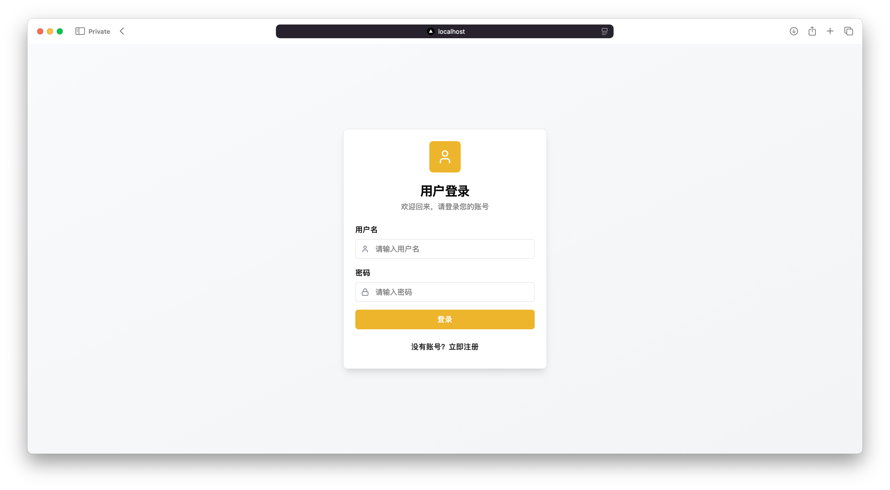
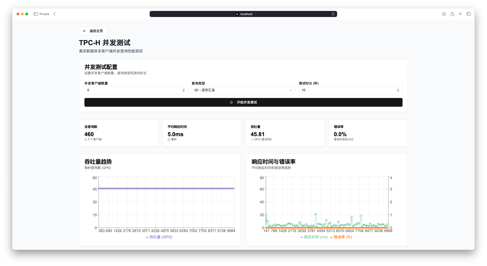

# 《数据库系统原理》课程设计报告

[TOC]

## 1. 引言

随着信息技术的飞速发展和电子商务的普及，数据管理系统在各行各业中扮演着至关重要的角色。数据库系统原理作为计算机科学的核心课程之一，旨在培养学生掌握数据库系统的基本理论、设计方法和应用技术。本次课程设计的目标是基于业界公认的TPC (Transaction Processing Performance Council) Benchmark，特别是TPC-H（决策支持）和TPC-C（联机事务处理）标准，设计并实现一个电商数据管理系统。

TPC-H模拟了供应商和采购商之间的交易行为，包含8张关系表和22条复杂的分析型SQL查询语句，用于评估系统的在线分析处理（OLAP）能力。TPC-C则模拟了典型的在线事务处理（OLTP）场景，包含10张关系表和5种基本事务类型，用于评估系统处理高并发事务的能力。

## 2. 系统需求分析

本TPC Benchmark电商数据管理系统旨在提供一个用户友好的界面，支持对TPC-H和TPC-C数据的管理、查询、分析及性能测试。系统功能需求主要分为以下几个模块：系统界面、用户管理、系统管理、数据管理、业务查询、TPC-H统计分析、TPC-C事务查询以及并发测试。

### 2.1 系统界面

系统界面是用户与系统交互的入口，应力求简洁、美观、易用。

- 登录界面：
  - 提供用户登录功能，需输入用户名和密码。
  - 提供用户注册功能。
  - 用户分为系统管理员和普通用户两类，登录后根据角色权限展示不同功能。
  - 应明确区分登录系统的口令和连接数据库的口令，普通用户不应知晓数据库连接凭证。
- 主界面布局：
  - 界面布置合理，采用一级菜单和二级菜单的导航方式。
  - 一级菜单对应主要功能模块：系统管理、用户管理、数据管理、业务查询、统计分析/并发测试。
  - 点击一级菜单项后，在相应区域或通过二级菜单展示该模块下的细分功能。
  - 选择数据库表名时，应使用下拉菜单等控件，避免将所有表名平铺在界面上。

### 2.2 用户管理

用户管理模块主要负责系统用户的认证和权限控制。 

- **用户角色：** 系统包含系统管理员和普通用户两类。
- 管理员功能：
  - 查看所有用户（包括普通用户）的注册信息。
  - 添加、删除普通用户账号。
  - 审批普通用户的注册申请（如果提供用户自主注册功能）。
  - 查看数据库连接状态、后台数据库服务器及数据库的配置信息（如物理分区、连接参数等）。
  - 可设置或修改部分数据库连接参数，如连接时长、缓冲区大小等。
- 普通用户功能：
  - 通过管理员分配的账号或自行注册（需管理员审批）并登录系统。
  - 可以修改个人密码。
  - 使用系统提供的各项业务查询、数据管理（权限范围内）和业务分析功能。

### 2.3 系统管理

系统管理模块主要由系统管理员操作，用于监控和配置系统及数据库。 

- **数据库配置查看：** 系统管理员可以查看后台数据库服务器（PostgreSQL）的基本配置信息，如数据库表所在的物理分区（表空间）、连接参数等。
- 性能监控与统计：
  - 当后台服务器执行TPC-H、TPC-C等复杂查询或并发测试时，系统应能统计并展示关键性能指标，如系统吞吐量、平均执行延迟等。
  - 这些指标可以以图表形式（如折线图、柱状图）动态展示。

### 2.4 数据管理

数据管理模块负责TPC-H和TPC-C基准测试数据的生成、导入、清洗和导出。

- **2.4.1 数据生成：**

  - 系统应集成或提供调用TPC-H数据生成脚本程序（`dbgen`）的功能。

  - 用户可以根据需要设定合适的数据规模参数（如Scale Factor，SF），生成测试数据，并存放在指定的文本文件（如`.txt`或`.tbl`）中。

  - 要求生成的数据总量应保证不低于600MB，以支持后续的性能评估分析。

  - 指导书中以

    ```
    dbgen -s 0.2
    ```

    生成200M数据为例，给出了各表的数据行数。

- **2.4.2 数据导入：**

  - 提供批量导入功能，将生成的测试数据文件导入到PostgreSQL数据库的对应关系表中。

  - 用户需能从生成的测试数据文件中选择至少2张规模较大的关系表进行导入（例如ORDERS, PARTSUPP, LINEITEM）。

  - 数据清洗：

    在数据导入过程中，对导入数据中的部分字段进行数据清洗。

    - 为每张导入的表中至少选取两个字段进行清洗。
    - 清洗类型包括：
      - 字段数据类型检查（例如，订单表ORDERS的属性O_TOTALPRICE应为数值型）。
      - 字段数据范围检查（例如，零部件供应表PARTSUPP的属性PS_AVAILQTY取值范围应为 >= 0）。
      - 字段空值检查（例如，订单明细表LINEITEM的属性L_QUANTITY不应为空）。
    - 导入和清洗过程应能正确识别不符合要求的数据，并在导入日志中记录不符合要求的数据行的行号及原因。
    - 导入过程不应因存在少量不符合要求的数据而终止，符合要求的规范数据必须全部导入数据库。
    - 若TPC-H生成的数据本身高度规范，为验证清洗效果，可允许用户手动修改部分数据文件内容以引入错误数据。

  - 其他关系表的数据可借助DBMS平台提供的导入机制（如PostgreSQL的`COPY`命令）手动导入，或也通过系统界面提供类似功能。

  - 存放导入数据的数据文件在系统中的存放路径必须是用户可选的，不允许在导入程序中采用固定的导入文件路径。

- **2.4.3 数据导出：**

  - 用户界面上应使用下拉列表显示数据库中的各个关系表。
  - 用户可以选择指定的某些表（至少3张表，如ORDERS），将表中数据以Excel（如`.xlsx`或`.csv`）或文本文件（`.txt`）格式导出。
  - 导出的文件中应当包含表中各个属性的名称（表头）。
  - 默认输出文件名为该关系表的表名。
  - 导出的数据文件在系统中的存放路径必须是用户可选的，不允许在导出程序中采用固定的导出文件存放路径。

### 2.5 业务查询

业务查询模块允许用户对导入的电商数据进行查询和分析。

- 一般要求：
  - 设计SQL查询语句（至少涉及两张表），或选择附录2中给出的典型TPC-H测试语句。
  - 设计客户端输入界面（用于输入查询条件）和结果输出界面。
  - 系统能够正确返回查询结果，并尽可能以图表等方式直观呈现。
  - 查询结果要求可以导出到文件中，并保存到用户可选的文件存储路径下。
- 具体查询类型：
  1. 客户信息查询：
     - 方式一：用户在查询界面的输入框中直接输入某客户的`C_NAME`或其所在国家的名称（`N_NAME`），系统以列表方式输出该客户的全部信息（来自CUSTOMER表及关联表如NATION）。
     - 方式二：程序在查询界面的下拉列表中列出客户表中的全部客户姓名或所在国家名称，用户通过下拉列表选择特定客户名称或国家，以列表方式输出相应的客户全部信息。
  2. 典型TPC-H查询：
     - 从指导书的典型TPC-H测试语句中，选择与订单（ORDER）或零部件（PART）相关的查询。
     - 对所选查询进行适当修改和完善，例如允许用户自定义部分查询条件（如日期范围、特定品牌等）。
     - 设计查询结果的呈现方式，要求查询结果能以图表的方式（如柱状图、饼图、折线图）直观呈现。

### 2.6 TPC-H 统计分析

此模块专注于执行和分析TPC-H标准中的复杂统计查询。 

- 从指导书附录2给出的典型TPC-H测试语句中，选择2条具有比较复杂的统计分析功能、并且执行时间较长的SQL查询语句（例如，带有复杂分组、聚集运算、多表连接的查询，如Q1定价汇总报表查询、Q9产品类型利润度量查询等）。
- 对这些SQL查询进行适当修改完善，并在系统内实现。
- 用户可以在客户端通过数据库访问接口将这些SQL查询请求传送至PostgreSQL服务器执行，对TPC-H数据库进行统计分析。
- 可以自行设计查询条件输入界面（例如，允许用户选择特定区域/国家、特定时间段的数据进行统计分析）和查询结果呈现方式。
- 要求：
  1. 记录每条SQL查询从客户端提交查询请求到接收到完整查询结果的总时间。
  2. 使用者（特别是管理员或高级用户）应能通过系统界面或借助PostgreSQL的工具（如pgAdmin的图形化执行计划，或通过系统调用`EXPLAIN ANALYZE`命令）提取和观察SQL查询的查询执行计划，分析其执行过程以及对索引的使用情况。

### 2.7 TPC-C 事务查询

此模块用于执行和分析TPC-C标准中的典型OLTP事务。

- 从指导书附录给出的典型TPC-C测试事务中，选择2个具有比较复杂的查询处理功能、并且执行时间较长的典型事务（例如，事务中带有`UPDATE`、`INSERT`等操作，如New-Order事务、Payment事务）。
- 用户可以在客户端启动、控制这些事务的执行，对数据库表进行增删改查。
- 可以自行设计事务参数的输入界面和事务执行结果的呈现方式。
- 要求：
  1. 记录每个事务从提交请求到完成执行并返回结果的总时间。
  2. 记录事务内部各条主要SQL查询语句的执行时间。
  3. 使用者应能通过系统界面或借助PostgreSQL的工具提取和观察关键SQL查询的查询执行计划，分析其执行过程以及对索引的使用情况。

### 2.8 TPC-H 并发测试

此模块用于模拟多用户并发执行TPC-H查询的场景，评估系统的OLAP并发处理能力。 

- 利用TPC-H测试程序（`dbgen`生成数据，`qgen`生成查询模板）。
- 采用Python，编写TPC-H并发测试程序（或集成现有测试驱动框架）。该程序应能：
  - 从一个或多个模拟客户端（线程或进程）。
  - 通过数据库接口（如psycopg2连接池）向PostgreSQL数据库并发提交一系列TPC-H SQL查询（基于`qgen`生成的模板，可随机化参数）。
- 系统应能启动TPC-H并发测试，并允许用户观察SQL事务的并发执行过程（例如，通过监控数据库活动连接、CPU/IO负载等）。
- 统计并展示系统吞吐量（如每小时查询数 QphH@Size）、平均查询响应延迟等系统性能指标。

### 2.9 TPC-C 并发事务测试

此模块用于模拟多用户并发执行TPC-C事务的场景，评估系统的OLTP并发处理能力。 

- 采用TPC-C测试程序（如BenchmarkSQL的Java实现，或自行编写Python脚本模拟其核心逻辑）生成TPC-C测试数据和测试事务。
- 系统应能支持从多个模拟客户端（并发终端）同时启动TPC-C测试。
- 观察事务的并发执行过程。
- 统计并展示系统吞吐量（如每分钟处理的新订单事务数 tpmC）、平均事务响应延迟等系统性能指标。

## 3. 系统设计

本系统采用现代Web应用中流行的三层B/S（浏览器/服务器）架构，前后端分离。前端负责用户交互和数据展示，后端负责业务逻辑处理和数据访问，数据库负责数据的持久化存储和管理。

### 3.1 系统架构

系统整体架构如下图所示：

```
+-------------------------------------------------------------------------------------+
|                                  用户 (Web浏览器)                                     |
+-------------------------------------------------------------------------------------+
                                          | (HTTP/HTTPS)
                                          v
+-------------------------------------------------------------------------------------+
|                                 表现层 (Next.js)                                  |
|-------------------------------------------------------------------------------------|
| - 用户界面 (登录、注册、主导航、数据管理界面、查询界面、统计分析界面、测试控制界面)     |
| - 组件化视图 (React组件)                                                             |
| - 状态管理 (如Context API, Redux, Zustand)                                           |
| - API请求处理 (axios/fetch)                                                         |
| - 客户端路由                                                                       |
+-------------------------------------------------------------------------------------+
                                          | (RESTful API Calls via HTTP/HTTPS)
                                          v
+-------------------------------------------------------------------------------------+
|                            应用层/业务逻辑层 (FastAPI)                               |
|-------------------------------------------------------------------------------------|
| - API接口定义 (路径参数、请求体、响应模型)                                             |
| - 用户认证与授权 (如JWT)                                                             |
| - 业务逻辑处理:                                                                     |
|   - 用户管理逻辑                                                                   |
|   - 系统管理逻辑 (配置读取、性能数据收集接口)                                          |
|   - 数据导入/导出逻辑 (调用数据清洗、批量操作)                                         |
|   - TPC-H 查询处理 (动态SQL构建、参数化查询)                                          |
|   - TPC-C 事务处理 (事务边界控制、多SQL操作组合)                                      |
|   - 并发测试控制逻辑 (启动、监控、结果收集)                                            |
| - 数据校验与序列化 (Pydantic模型)                                                      |
| - 异步任务处理 (可选，如Celery，用于耗时操作如大规模数据导入/测试)                        |
| - 数据库连接管理 (SQLAlchemy ORM 或 psycopg2 连接池)                                 |
+-------------------------------------------------------------------------------------+
                                          | (SQL Queries, Stored Procedures, Triggers)
                                          v
+-------------------------------------------------------------------------------------+
|                              数据访问与持久层 (PostgreSQL)                             |
|-------------------------------------------------------------------------------------|
| - 数据库引擎 (查询处理与优化、存储管理、事务管理、并发控制)                             |
| - 数据库模式:                                                                       |
|   - TPC-H 关系表 (ORDERS, LINEITEM, PART, PARTSUPP, CUSTOMER, SUPPLIER, NATION, REGION) |
|   - TPC-C 关系表 (WAREHOUSE, DISTRICT, CUSTOMER_TPCC, HISTORY, NEW_ORDER_TPCC,       |
|                    ORDER_TPCC, ORDER_LINE_TPCC, ITEM, STOCK)                        |
| - 存储过程与函数 (用于复杂计算或封装常用操作)                                           |
| - 触发器 (例如，用于数据导入时的自动更新或校验)                                        |
| - 索引 (B-tree, Hash等，用于加速查询)                                                 |
| - 数据文件、日志文件管理 (表空间)                                                     |
+-------------------------------------------------------------------------------------+
```

**层次说明：**

1. **表现层 (Presentation Layer - Next.js)：**
   - 使用Next.js（基于React的JavaScript框架）构建用户界面。
   - 负责用户输入捕获、界面展示、向应用层发起API请求以及处理API响应。
   - 实现了组件化开发，提高了代码复用性和可维护性。
   - 可以利用Next.js的服务端渲染(SSR)或静态站点生成(SSG)特性优化首屏加载速度和SEO。
2. **应用层/业务逻辑层 (Application/Business Logic Layer - FastAPI)：**
   - 使用FastAPI（基于Python的高性能Web框架）构建RESTful API服务。
   - 负责处理所有业务逻辑，如用户认证、数据处理、查询执行、事务控制等。
   - 通过Pydantic模型进行数据校验和序列化，保证接口数据的规范性和安全性。
   - 与数据访问层交互，执行数据库操作。
   - FastAPI的异步特性使其能高效处理并发请求。
3. **数据访问与持久层 (Data Access & Persistence Layer - PostgreSQL)：**
   - 选用PostgreSQL作为关系型数据库管理系统。
   - 负责数据的存储、管理和检索。
   - 定义TPC-H和TPC-C的数据库模式，包括表、视图、索引、存储过程和触发器。
   - 执行由应用层传递过来的SQL查询和事务操作。
   - 利用PostgreSQL强大的查询优化器、事务管理和并发控制机制保证数据的一致性和系统性能。

### 3.2 软件模块设计

系统根据功能需求划分为前端模块和后端模块。

#### **3.2.1 前端模块 (Next.js)**

- 认证模块 (Auth Module):
  - 登录页面组件
  - 注册页面组件
  - 处理用户登录/注册请求，管理用户会话 (存储JWT Token)。
- 布局与导航模块 (Layout & Navigation Module):
  - 菜单生成与路由跳转逻辑。
- 用户管理模块 (User Management Module):
  - (管理员) 用户列表展示组件。
  - (管理员) 添加/编辑/删除用户表单组件。
  - (普通用户) 个人信息修改组件。
- 系统管理模块 (System Management Module):
  - (管理员) 数据库配置信息展示组件。
  - (管理员) 系统性能监控图表组件 (实时或历史数据)。
- 数据管理模块 (Data Management Module):
  - 数据生成控制组件 (调用`dbgen`的接口)。
  - 数据导入组件 (文件选择、目标表选择、进度显示、日志查看)。
  - 数据导出组件 (表选择、导出格式选择、路径选择)。
- 业务查询模块 (Business Query Module):
  - 客户信息查询组件 (输入框、下拉选择、结果表格)。
  - TPC-H通用查询界面组件 (查询选择、参数输入、结果图表与表格展示、结果导出)。
- TPC-H统计分析模块 (TPC-H Analysis Module):
  - 特定TPC-H复杂查询执行界面 (参数配置、执行控制)。
  - 查询执行时间显示。
  - 查询执行计划展示组件。
- TPC-C事务查询模块 (TPC-C Transaction Module):
  - 特定TPC-C事务执行界面 (事务参数输入、执行控制)。
  - 事务执行时间及内部SQL时间显示。
  - 事务执行结果展示。
- 并发测试模块 (Concurrency Test Module):
  - TPC-H并发测试配置与启动组件。
  - TPC-C并发测试配置与启动组件。
  - 测试过程监控与结果展示组件 (吞吐量、延迟图表)。
- 通用组件模块 (Common Components Module):
  - 表格、图表 (如使用Recharts, Chart.js)、模态框、通知提示等可复用UI组件。

#### **3.2.2 后端模块 (FastAPI+next.js Serverless)**

- API网关/路由模块 (`main.py`):
  - 定义所有API端点 (endpoints) 及其路由。
  - 引入各功能模块的路由器。
- 认证与授权模块:
  - 处理用户登录请求，验证凭据，生成和校验JWT Token。
  - 提供API接口保护的依赖项 (dependencies)。
- 用户管理服务模块:
  - 实现用户信息的增删改查逻辑。
  - 与数据库交互，管理用户信息。
- 系统管理服务模块:
  - 提供获取数据库配置信息的接口。
  - 提供记录和查询系统性能指标的接口。
- 数据管理服务模块:
  - **数据生成接口：** 封装调用`dbgen`脚本的逻辑。
  - 数据导入接口：
    - 接收上传的数据文件。
    - 实现数据分批读取和清洗逻辑 (类型、范围、空值检查)。
    - 调用数据库批量插入方法 (如PostgreSQL的`COPY`命令的封装)。
    - 记录导入日志。
  - 数据导出接口：
    - 根据请求从数据库查询数据。
    - 将数据格式化为指定的Excel或txt格式并提供下载。
- TPC-H查询服务模块 :
  - 接收前端传递的查询ID和参数。
  - 构建和执行相应的TPC-H SQL查询语句 (使用参数化查询防止SQL注入)。
  - 返回查询结果。
  - 提供获取查询执行计划的接口 (执行`EXPLAIN ANALYZE`并返回结果)。
- TPC-C事务服务模块:
  - 实现TPC-C标准事务的业务逻辑 (如New-Order, Payment)。
  - 在一个数据库事务中执行多个SQL操作，确保原子性。
  - 返回事务执行结果和相关信息。
- 并发测试服务模块:
  - TPC-H并发测试接口：
    - 接收测试配置参数 (并发数、查询流等)。
    - 启动并发测试线程/进程，模拟多用户执行TPC-H查询。
    - 收集并返回性能指标。
  - TPC-C并发测试接口：
    - 接收测试配置参数 (仓库数、终端数、运行时间/事务数等)。
    - 调用BenchmarkSQL的逻辑或自实现的TPC-C测试驱动。
    - 收集并返回性能指标 (tpmC等)。
- 数据库交互模块:
  - 配置和管理PostgreSQL数据库连接 (可以使用SQLAlchemy ORM或psycopg2连接池)。
  - 提供执行原生SQL、调用存储过程的通用函数。
- 模型定义模块:
  - 使用Pydantic定义API请求体和响应体的数据模型。
  - (如果使用ORM) 定义数据库表的模型。

### 3.3 数据库设计（索引、存储过程与触发器）

数据库设计是本系统的核心，包括TPC-H和TPC-C两部分。

#### **3.3.1 E-R图设计**

- TPC-H E-R图：

  基本遵循指导书所示的TPC-H关系模式图。该图清晰地展示了8个实体（PART, SUPPLIER, PARTSUPP, CUSTOMER, ORDERS, LINEITEM, NATION, REGION）及其之间的关系。

  - 例如：ORDERS与CUSTOMER是多对一关系，ORDERS与LINEITEM是一对多关系，PARTSUPP是PART和SUPPLIER的多对多连接表。

- TPC-C E-R图：

  基本遵循指导书所示的TPC-C关系图。该图展示了9个主要实体（WAREHOUSE, DISTRICT, CUSTOMER, HISTORY, NEW-ORDER, ORDER, ORDER-LINE, ITEM, STOCK）及其关系。

  - 例如：WAREHOUSE与DISTRICT是一对多关系，DISTRICT与CUSTOMER是一对多关系，ORDER与ORDER-LINE是一对多关系。


#### 3.3.2 函数/存储过程/触发器设计

**数据导入触发器：**

- 设计思路：在PostgreSQL中，可以创建一个`BEFORE INSERT ON EACH ROW`类型的触发器函数。当批量导入数据时（例如通过`COPY`到一个临时表，然后从临时表插入到目标表，或者直接使用ORM的批量插入功能），此触发器可以检查主键是否已存在于目标表中。
- 具体实现（以ORDERS表为例，使用PostgreSQL的PL/pgSQL）：

```sql
CREATE OR REPLACE FUNCTION handle_orders_import()
RETURNS TRIGGER AS $$
BEGIN
    -- 检查O_ORDERKEY是否已存在
    IF EXISTS (SELECT 1 FROM ORDERS WHERE O_ORDERKEY = NEW.O_ORDERKEY) THEN
        -- 如果存在，则更新记录 (这里仅为示例，实际更新字段需确定)
        UPDATE ORDERS
        SET O_CUSTKEY = NEW.O_CUSTKEY,
            O_ORDERSTATUS = NEW.O_ORDERSTATUS,
            O_TOTALPRICE = NEW.O_TOTALPRICE,
            O_ORDERDATE = NEW.O_ORDERDATE,
            O_ORDERPRIORITY = NEW.O_ORDERPRIORITY,
            O_CLERK = NEW.O_CLERK,
            O_SHIPPRIORITY = NEW.O_SHIPPRIORITY,
            O_COMMENT = NEW.O_COMMENT
        WHERE O_ORDERKEY = NEW.O_ORDERKEY;
        RETURN NULL; -- 阻止原始的INSERT操作
    ELSE
        -- 如果不存在，则允许插入
        RETURN NEW;
    END IF;
END;
$$ LANGUAGE plpgsql;

CREATE TRIGGER orders_import_trigger
BEFORE INSERT ON ORDERS
FOR EACH ROW EXECUTE FUNCTION handle_orders_import();
```

**统计分析函数/存储过程：**

- 对于TPC-H中一些固定的、计算密集的统计步骤，可以考虑封装为PostgreSQL的函数或存储过程。例如，计算特定时间范围内的平均销售额等。

- 优点：减少网络传输，编译后存储在数据库服务器上可被重用，可能提高执行效率。

- 示例（虚构一个简单函数）：

  ```sql
  CREATE OR REPLACE FUNCTION get_average_order_price(start_date DATE, end_date DATE)
  RETURNS DECIMAL AS $$
  DECLARE
      avg_price DECIMAL;
  BEGIN
      SELECT AVG(O_TOTALPRICE) INTO avg_price
      FROM ORDERS
      WHERE O_ORDERDATE >= start_date AND O_ORDERDATE <= end_date;
      RETURN avg_price;
  END;
  $$ LANGUAGE plpgsql;
  ```

#### **3.3.3 索引设计**

索引是提高查询性能的关键。根据TPC-H的22条查询和TPC-C的5种事务的特性，在相关表的关键属性上建立索引。

**基本原则：**

- 为主键自动创建唯一索引。
- 为外键创建索引，以加速连接操作。
- 为经常出现在`WHERE`子句中的查询条件列创建索引。
- 为经常出现在`ORDER BY`和`GROUP BY`子句中的列创建索引。
- 对于组合查询条件，考虑创建复合索引。
- 避免过多索引，因为索引会增加写操作（INSERT, UPDATE, DELETE）的开销并占用存储空间。

**TPC-H索引设计：**

- `LINEITEM`表：
  - `CREATE INDEX idx_lineitem_orderkey ON LINEITEM (L_ORDERKEY);` (主键部分，外键)
  - `CREATE INDEX idx_lineitem_partkey_suppkey ON LINEITEM (L_PARTKEY, L_SUPPKEY);` (复合外键，常用于连接)
  - `CREATE INDEX idx_lineitem_shipdate ON LINEITEM (L_SHIPDATE);` (Q1, Q6, Q10, Q12, Q14, Q20 等查询中常用)
  - `CREATE INDEX idx_lineitem_returnflag_linestatus ON LINEITEM (L_RETURNFLAG, L_LINESTATUS);` (Q1中`GROUP BY`和`ORDER BY`用到)
- `ORDERS`表：
  - `CREATE INDEX idx_orders_custkey ON ORDERS (O_CUSTKEY);` (外键)
  - `CREATE INDEX idx_orders_orderdate ON ORDERS (O_ORDERDATE);` (Q3, Q4, Q5, Q10 等查询中常用)
- `CUSTOMER`表：
  - `CREATE INDEX idx_customer_nationkey ON CUSTOMER (C_NATIONKEY);` (外键)
  - `CREATE INDEX idx_customer_mktsegment ON CUSTOMER (C_MKTSEGMENT);` (Q3中用到)

​	`PART`, `SUPPLIER`, `PARTSUPP`, `NATION`, `REGION`表的外键和常用查询字段也应建立索引。例如，`NATION(N_REGIONKEY)`, `SUPPLIER(S_NATIONKEY)`。

**TPC-C索引设计**：

- TPC-C事务对响应时间要求极高，索引设计至关重要。
- 除了主键和外键索引外：
- `CUSTOMER_TPCC`表：`CREATE INDEX idx_customer_tpcc_w_d_last_first ON CUSTOMER_TPCC (C_W_ID, C_D_ID, C_LAST, C_FIRST);` (Payment事务按姓氏查询客户)
- `ORDER_TPCC`表：`CREATE UNIQUE INDEX idx_order_tpcc_w_d_c_id ON ORDER_TPCC (O_W_ID, O_D_ID, O_C_ID, O_ID DESC);` (Order-Status事务查询客户最新订单)
- `NEW_ORDER_TPCC`表：`CREATE INDEX idx_new_order_tpcc_w_d_o ON NEW_ORDER_TPCC (NO_W_ID, NO_D_ID, NO_O_ID);` (Delivery事务需要)

索引建立后，需通过`EXPLAIN ANALYZE`验证查询是否有效利用了索引，并根据实际运行情况调整。

**3.3.5 批量导入设计**

遵循指导书6.1节的批量导入原则，在Nextjs Serverless后端实现。

1. 分批读取：
   - 前端上传数据文件（如`.tbl`或`.csv`）到API。
   - FastAPI后端以流式方式读取文件，或设定一个合理的批次大小（我们使用的为1000行，根据内存和行大小估算），分批次将数据读入内存中的数据结构。不能一次性将大文件全部读入内存。

2. **数据清洗：**

   - 在内存中对当前批次的数据进行清洗：
     - **类型检查与转换：** 确保数值型字段是数值，日期型字段是日期等。尝试转换，失败则标记为错误数据。
     - **范围检查：** 例如，`PS_AVAILQTY >= 0`。
     - **空值检查：** 对于`NOT NULL`字段，检查是否为空。

   - 不符合要求的数据行及其错误信息记录到导入日志中，该行数据不进行导入。

3. **批量插入：**

   - 对清洗后合格的内存数据，使用PostgreSQL高效的批量插入机制。
     - **方法：`COPY ... FROM STDIN`**：API可以将内存中的数据格式化为`COPY`命令接受的格式（如CSV），然后通过`copy_expert`或类似方法将数据流式传输到PostgreSQL的`COPY`命令，实现非常高效的批量插入。
     - **`INSERT ... ON CONFLICT DO UPDATE/NOTHING`：** 如前述触发器部分讨论，如果需要处理主键冲突（即更新已存在数据），可以在批量插入时使用此语句。这比行级触发器效率更高。
   - 清洗后的数据直接从内存批量写入数据库，避免回写到磁盘文件再导入。

4. **进度与日志：**

   - 后端可以维护导入进度（已处理行数/总行数），前端可以轮询接口获取进度并展示。
   - 导入完成后，向前端返回导入结果摘要和日志文件。

### 3.4 数据库物理文件/文件组设计

- **PostgreSQL的物理存储结构：**
  - PostgreSQL的数据存储在表空间（Tablespace）中。默认情况下，所有数据库对象都存储在`pg_default`（数据）和`pg_global`（全局对象）表空间中。
  - 数据库文件由数据文件（存储表和索引数据）、预写日志（WAL）文件（用于崩溃恢复和流复制）等组成。

- **设计考虑：**

  - **创建数据库：** 使用`CREATE DATABASE`语句创建本课程设计所需的数据库。

  - 表空间管理：

    可以创建自定义表空间，并将它们映射到不同的物理磁盘分区。例如：

    ```sql
    CREATE TABLESPACE fast_disk_ts LOCATION '/mnt/ssd_partition/pgdata_fast';
    CREATE TABLESPACE archive_disk_ts LOCATION '/mnt/hdd_partition/pgdata_archive';
    ```

    可以将频繁访问的表和索引（如TPC-C的核心表、TPC-H的`LINEITEM`表）放置在IO性能较高的磁盘（如SSD）对应的表空间上：

    ```sql
    CREATE TABLE ORDERS (...) TABLESPACE fast_disk_ts;
    CREATE INDEX idx_lineitem_shipdate ON LINEITEM (L_SHIPDATE) TABLESPACE fast_disk_ts;
    ```

    可以将日志文件（WAL）也配置到单独的、高可靠性的磁盘分区。这通过`postgresql.conf`中的`wal_log_hints`和操作系统层面的挂载点管理实现。

    **我们使用Docker部署数据库，因此这样的映射更为方便了。**

### 3.5 接口访问接口设计

本系统的API接口设计分为两部分：一部分由**Next.js Serverless Functions**处理，主要负责相对简单、轻量级的请求以及作为前端的直接API网关；另一部分由**FastAPI应用**处理，专注于计算密集型、复杂度较高的TPC-C和TPC-H Benchmark核心事务、查询及并发测试逻辑。所有接口均使用JSON格式进行数据交换。

**3.5.1 Next.js Serverless API (前端API网关与简单业务处理)**

这些API端点部署为Next.js的Serverless Functions，基础路径为 `/api`。

- **认证接口 (`/api/auth`)**
  - `POST /api/auth/login`: 用户登录。
  - `POST /api/auth/register`: 用户注册。
  - `POST /api/auth/logout`: 用户登出。
  - `GET /api/auth/me`: 获取当前登录用户信息。
  - `POST /api/auth/change-password`: 修改当前用户密码。
- **用户管理接口 (`/api/users`)**
  - `GET /api/users`: 获取用户列表（管理员）。
  - `POST /api/users`: 创建新用户（管理员或用户注册）。
  - `GET /api/users/pending`: 获取待审批用户列表（管理员）。
  - `GET /api/users/{id}`: 获取特定用户信息。
  - `PUT /api/users/{id}`: 更新特定用户信息。
  - `DELETE /api/users/{id}`: 删除特定用户（管理员）。
  - `POST /api/users/{id}/approve`: 审批通过用户注册（管理员）。
  - `POST /api/users/{id}/reject`: 拒绝用户注册（管理员）。
  - `PUT /api/users/{id}/password`: 修改指定用户密码（管理员）。
  - `GET /api/users/{id}/status`: 获取用户状态。
  - `PUT /api/users/{id}/status`: 修改用户状态（如激活/禁用，管理员）。
- **客户数据接口 (`/api/customers`)**
  - `GET /api/customers/names`: 获取客户姓名列表（用于下拉选择等）。
  - `POST /api/customers/search`: 根据条件搜索客户信息。
  - `POST /api/customers/filter`: （更复杂的）客户信息筛选。
- **地理位置数据接口 (`/api/countries`)**
  - `GET /api/countries`: 获取国家列表。
- **数据库管理接口 (`/api/database`)**
  - `GET /api/database/config`: 获取数据库配置摘要（管理员）。
  - `POST /api/database/config`: 修改数据库配置（管理员）。
  - `POST /api/database/test-connection`: 测试与数据库的连接。 (此路径与根目录下的 `/api/test-connection` 功能相似或为其具体实现)
- **数据导入接口**
  - `POST /api/import-data`: 批量导入数据（例如，上传文件后处理）。
  - `POST /api/import-data-stream`: 流式数据导入处理。
- **特定业务查询接口**
  - `POST /api/order-part-queries`: 执行与订单或零部件相关的特定、预定义查询。
- **TPC-H 相关接口 (轻量级)**
  - `GET /api/tpc-h-queries`: 获取TPC-H查询的列表或元数据。
  - `POST /api/tpc-h-query`: 执行单个、相对简单的TPC-H查询（复杂查询由FastAPI处理）。
  - `POST /api/tpc-h-concurrent`: 启动或管理TPC-H并发测试的前端控制接口（实际执行可能委托给FastAPI）。
- **TPC-C 相关接口 (轻量级)**
  - `POST /api/tpc-c-query`: 执行单个、相对简单的TPC-C相关查询。
  - `POST /api/tpc-c-transactions`: 执行单个、轻量级的TPC-C事务（核心事务由FastAPI处理）。
  - `POST /api/tpc-c-concurrent`: 启动或管理TPC-C并发测试的前端控制接口（实际执行为FastAPI）。
- **通用接口**
  - `POST /api/test-connection`: 通用连接测试接口。

**3.5.2 FastAPI API (复杂Benchmark处理)**

这些API端点由独立的FastAPI服务提供，专注于处理计算密集和状态管理复杂的TPC Benchmark。基础路径也约定为 `/api`（在实际部署中，会通过不同的端口或网关配置与Next.js API区分）。

- **TPC-C 核心事务与并发测试接口 (`/api/tpcc`)**

  - `POST /api/tpcc/new-order`: 执行完整的TPC-C New-Order事务。

    - 请求体: 包含w_id, d_id, c_id, item_list (ol_i_id, ol_supply_w_id, ol_quantity)等。

    `POST /api/tpcc/payment`: 执行完整的TPC-C Payment事务。

    - 请求体: 包含w_id, d_id, c_w_id, c_d_id, c_id (或c_last), h_amount等。

    `POST /api/tpcc/order-status`: 执行完整的TPC-C Order-Status事务。

    - 请求体: 包含w_id, d_id, c_id (或c_last)等。

    `POST /api/tpcc/delivery`: 执行完整的TPC-C Delivery事务。

    - 请求体: 包含w_id, o_carrier_id等。

    `POST /api/tpcc/stock-level`: 执行完整的TPC-C Stock-Level事务。

    - 请求体: 包含w_id, d_id, threshold等。

    `POST /api/tpcc/max-order-id`: (辅助接口) 获取指定区域的最大订单ID，可能用于Delivery事务的触发。

    - 请求体: 包含w_id, d_id。

    `POST /api/tpcc/concurrent`: 启动并执行TPC-C并发基准测试。

    - 请求体: 包含测试配置参数，如warehouses, terminals, run_time/num_txns_per_terminal, transaction_mix_weights等。
    - 响应: 测试ID、状态、最终的tpmC等性能指标。

- TPC-H 核心查询与并发测试接口 (`/api/tpch`)

  - `POST /api/tpch/query`: 执行指定的TPC-H查询（支持标准查询）。

    - 请求体: 包含查询ID (e.g., "Q1", "Q6") 及该查询所需的参数。
    - 响应: 查询结果集、执行时间、可能的执行计划摘要。

    `POST /api/tpch/concurrent`: 启动并执行TPC-H并发基准测试。

    - 请求体: 包含测试配置参数，如scale_factor, num_streams (并发客户端数), duration/num_queries_per_stream, query_selection_mix等。
    - 响应: 测试ID、状态、最终的QphH@Size、吞吐量、延迟等性能指标。

    `GET /api/tpch/queries`: 获取可执行的TPC-H查询列表及其参数说明（此接口与Next.js中的 `/api/tpc-h-queries`功能可能相似或互补，FastAPI侧重于提供给测试驱动程序可用的查询元数据）。

通过这样的划分，Next.js Serverless Functions可以快速响应前端的常规请求，而将资源消耗大、执行时间长的Benchmark核心逻辑交由专门的、可独立扩展的FastAPI服务处理，从而优化整体系统性能和可维护性。

## 4. 系统实现

本章节将阐述TPC Benchmark电商数据管理系统的具体实现细节，包括开发环境、所用技术栈以及核心功能的实现思路。

### 4.1 软硬件平台

- 硬件平台：
  - 开发机/测试机：
    - CPU: Apple M1 Pro
    - 内存 (RAM): 32GB
    - 存储: SSD 512GB
  - **服务器：**腾讯云（FastAPI）+ Vercel托管（Nextjs前端+Serverless API）
- **软件平台：**
  - **操作系统：** Linux (Ubuntu 22.04 LTS), macOS 15.4
  - **Web浏览器：** Google Chrome, Mozilla Firefox, Microsoft Edge (最新版本，用于访问Next.js前端应用)。

### 4.2 开发环境

- **数据库：** PostgreSQL (版本13.x 或更高版本，支持`INSERT ... ON CONFLICT`等现代SQL特性)。
- 后端：
  - Python (版本3.10)。
  - FastAPI。
  - Uvicorn (ASGI服务器，用于运行FastAPI应用)。
  - `asyncpg` (PostgreSQL的Python驱动程序)。
  - `python-jose[cryptography]` (用于JWT认证)。
  - `pydantic` (FastAPI依赖，用于数据模型定义和校验)。
- **前端：**
  - Node.js 。
  - Ppm
  - Next.js。
  - React (Next.js依赖)。
  - UI库：Tailwind CSS。
  - 内置 `fetch` API (用于与FastAPI后端进行HTTP通信)。
- **版本控制：** Git，配合GitHub/GitLab/Bitbucket等进行代码托管和协作。
- **TPC工具：**
  - TPC-H `dbgen`和`qgen`工具 (从TPC官网下载并编译，用于生成TPC-H数据和查询模板)。

### 4.3 编程语言

- **后端：** Python (FastAPI) + TypeScript (Next.js)
- **前端：** TypeScript 。
- **数据库 (PostgreSQL)：** SQL (用于查询和数据操作), PL/pgSQL (用于编写存储过程和触发器函数)。

### 4.4 采用的框架与核心库

- Next.js (前端框架)：
  - **路由：** 基于文件系统的路由 (`pages`目录)。
  - **组件：** 使用React函数组件和Hooks进行UI构建。
  - **API路由：** Next.js本身通过的API路由+FastAPI路由+反向代理
  - **状态管理：** React Context API, Zustand,或Redux (根据复杂度选择)。
  - **UI：** (以Ant Design为例) `antd`库提供丰富的预设组件。
- **FastAPI (后端框架)：**
  - **Web服务器：** Uvicorn。
  - **路由：** 使用装饰器 (`@app.get`, `@app.post`等) 定义API路径和HTTP方法。
  - **数据模型与校验：** Pydantic模型定义请求体、响应体和路径/查询参数，FastAPI自动进行数据校验和文档生成。
  - **依赖注入：** FastAPI强大的依赖注入系统，用于处理认证、数据库会话等。
  - **异步支持：** 使用`async`和`await`关键字实现异步API处理，提高并发性能。
  - 数据库交互：
    - 使用`psycopg2`直接执行SQL语句和调用PostgreSQL的`COPY`命令进行批量导入。
    - 或者使用`SQLAlchemy` Core (Expression Language) 构建SQL查询，或SQLAlchemy ORM进行对象关系映射。推荐使用连接池（如SQLAlchemy的`create_engine`自带或`DBUtils`）管理数据库连接。
  - **认证：** 使用`python-jose`库实现JWT (JSON Web Tokens) 的生成和验证，保护API接口。
- **PostgreSQL (数据库)：**
  - 利用其ACID特性保证事务的完整性。
  - 强大的SQL支持，包括窗口函数、CTE（公共表表达式）、JSON处理等。
  - 高效的索引机制 (B-tree, GIN, GiST等)。
  - `EXPLAIN ANALYZE`命令用于查询性能分析。
  - `COPY`命令用于高效的批量数据导入/导出。

### 4.5 核心功能实现思路

#### **4.5.1 用户认证与授权**

- FastAPI+Serverless后端：
  1. **注册：** 用户提交用户名、密码等信息。密码使用库进行哈希加盐存储。
  2. **登录：** 用户提交用户名、密码。后端验证凭据，成功后生成JWT。JWT中包含用户ID、角色等信息，并设置过期时间。
  3. **Token传递：** JWT作为Bearer Token在后续API请求的`Authorization`头中传递。
  4. **接口保护：** FastAPI使用依赖注入创建一个函数，该函数从请求头中提取并验证JWT。如果Token有效且用户具有所需权限，则允许访问接口；否则返回401或403错误。
- Next.js前端：
  1. 登录成功后，将JWT存储在浏览器的`localStorage`或`sessionStorage`或HTTP-only Cookie中。
  2. 在发起API请求时，从存储中读取JWT并添加到请求的`Authorization`头。
  3. 根据用户角色动态显示或隐藏界面元素和功能。

#### **4.5.2 数据批量导入与清洗 (TPC-H)**

TPC-H数据的批量导入与清洗功能由 **Next.js Serverless Function** (`/api/import-data-stream/route.ts`) 后端处理，实现了流式文件处理、数据校验和批量数据库插入。

- **前端 (Next.js Page/Component):**

  1. 文件与参数选择：

     - 提供文件上传组件，用户选择本地的TPC-H数据文件（如 `orders.tbl`，后缀通常为 `.tbl` 或 `.txt`）。
     - 提供下拉菜单让用户选择要导入的目标TPC-H表名（如 `orders`, `lineitem` 等，共8张表）。
     - 用户可以指定数据文件中的列分隔符（默认为 `|`）。

  2. **发起导入请求：**

     - 将文件对象、选择的表名和分隔符通过 `FormData` 以 POST 请求方式发送到 Next.js 的 `/api/import-data-stream` API 接口。

     - 前端使用 `fetch` API 发起请求，并处理服务端返回的流式响应。
     - 响应流中包含两种类型的消息：`progress` (导入过程中的进度更新) 和 `complete` (导入完成后的最终结果) 或 `error` (发生错误时)。
     - 根据消息类型，前端动态更新导入进度条、已处理行数、成功导入行数、失败行数以及最近的错误日志。

  **后端 (Next.js Serverless Function - `/api/import-data-stream/route.ts`):**

  1. 接收请求与参数校验：

     - 通过 `request.formData()` 获取上传的文件、目标表名和分隔符。
     - 校验是否存在文件和表名。
     - 检查文件大小，例如限制为2GB。
     - 校验表名是否在预定义的 `dataValidationRules` 中支持（覆盖TPC-H的8张表：`orders`, `partsupp`, `lineitem`, `customer`, `part`, `supplier`, `nation`, `region`）。

  2. 定义数据清洗规则 (`dataValidationRules`):

     - 为一个包含所有8张TPC-H表的配置对象。
     - 每张表的规则包括：
       - `fields`: 一个数组，定义了该表数据文件中期望的字段顺序和名称。
       - `validations`: 一个对象，键为字段名，值为一个验证函数。该函数接收字段的字符串值作为输入，如果验证通过则返回 `null`，否则返回错误描述字符串。
       - 验证示例 (orders表):
         - `o_orderkey`: 必须为正整数。
         - `o_totalprice`: 必须为正数。
         - `o_orderdate`: 必须符合 `YYYY-MM-DD` 格式。
       - 验证示例 (lineitem表):
         - `l_quantity`: 必须为正数。
         - `l_discount`: 必须在0到1之间。
         - `l_shipdate`: 必须符合 `YYYY-MM-DD` 格式。
       - **通用校验：** 对大部分表的ID字段（如 `_key` 后缀）实现正整数校验；对价格、成本、余额等实现数值或正数校验；对日期字段实现格式校验；对部分文本字段（如 `n_name`, `r_name`）实现非空和长度校验。Comment字段通常允许为空。

  3. **流式文件处理 (`processFileStream` 函数):**

     - 使用 `TextDecoder` 和 `file.stream().getReader()` 逐块读取文件流，避免一次性加载大文件到内存。
     - 维护一个缓冲区 (`buffer`) 处理跨块的行数据。
     - 行处理与数据校验：
       - 按行分割数据，并根据指定的分隔符解析出字段值。
       - **字段数量检查：** 验证解析出的字段数量是否与 `dataValidationRules` 中定义的 `fields` 数量一致。不一致则记录错误。
       - **空值检查：** 对 `dataValidationRules` 中定义的每个字段（除了明确允许为空的，如 comment 字段），检查其值是否为空（或仅包含空格）。为空则记录错误。
       - **规则校验：** 对每个字段值，应用 `dataValidationRules` 中对应表和字段的验证函数。验证失败则记录错误。
     - **错误记录：** 记录发生错误的行号、错误原因及部分原始行数据。

     **批量插入与回退机制：**

     - 将通过所有校验的合格数据行暂存到一个批次数组 (`batch`) 中。
     - 当批次大小达到预设值或文件处理完毕时，调用 `executeBatchInsert(table, fields, batch)` 函数尝试将整个批次的数据批量插入到PostgreSQL数据库的对应表中。此函数封装了数据库批量插入的逻辑（例如，可能使用 `pg` 库构建多行 `INSERT` 语句或 `COPY` 命令的等效操作）。
     - **批量插入失败处理：** 如果 `executeBatchInsert` 失败，系统会尝试对该批次中的数据进行逐行插入 (`executeSingleInsert(table, fields, rowData)`）。这样做是为了定位到具体是哪一行或哪些行导致了数据库层面的错误（如违反唯一约束、外键约束等），并将这些特定错误记录下来。成功的单行插入仍计入 `importedRows`。
     - 更新已处理行数 (`processedRows`)、成功导入行数 (`importedRows`) 和失败行数 (`failedRows`)。

     **进度上报与流式响应：**

     - 在 `processFileStream` 函数中，通过回调函数 `onProgress` 定期（例如每处理10000行）将当前的导入进度（已处理、已导入、已失败的行数及最新的错误示例）发送给调用方。
     - `POST` 接口的 `route.ts` 中，创建一个 `ReadableStream`。在 `start` 方法内调用 `processFileStream`。
     - 当 `onProgress` 回调被触发时，将进度数据封装成 JSON 对象（如 `{ type: "progress", data: progress }`），编码后通过 `controller.enqueue()` 推送到响应流。
     - 文件处理完成后，将最终的汇总结果（总行数、导入行数、失败行数、所有错误详情）封装成 JSON 对象（如 `{ type: "complete", data: result }`）推送到响应流。
     - 如果过程中发生严重错误，则推送错误消息（如 `{ type: "error", data: { error: errorMessage } }`）。
     - 响应头设置 `Content-Type: "text/plain; charset=utf--8"` 和 `Transfer-Encoding: "chunked"` 以支持流式输出。

     **错误处理：** 对文件读取、数据处理、数据库操作等环节进行全面的 `try-catch` 错误捕获，并将错误信息返回给前端。

  通过这种流式处理和批量插入（带单行回退）的方式，系统能够在处理大规模TPC-H数据文件时，保持较低的内存占用，提供实时的进度反馈，并能较好地处理数据清洗和导入过程中的错误。

#### **4.5.3 TPC-H查询执行与分析**

- Next.js前端：

1. 用户选择一个TPC-H查询（如Q1），输入必要的参数（如日期）。
2. 将查询标识和参数POST到FastAPI后端。
3. 接收后端返回的查询结果（通常是JSON数组），使用表格组件展示。
4. 如果结果适合图表化，使用图表库生成图表。
5. 提供按钮请求该查询的执行计划，并展示后端返回的文本计划。

- FastAPI后端 (`tpch_query_service.py`)：
  1. 根据查询标识和参数，从预定义的SQL模板生成最终的SQL语句。
  2. 使用数据库连接执行SQL查询，记录执行时间。
  3. 返回查询结果。
  4. 对于执行计划请求，执行`EXPLAIN ANALYZE <SQL语句>`，并将返回的文本结果直接传递给前端。

#### 4.5.4 TPC-C事务实现 (以New-Order为例)

- Next.js前端：
  1. 提供表单让用户输入New-Order事务所需的参数（W_ID, D_ID, C_ID, 以及一个包含 item_id, supply_w_id, quantity 的列表）。
  2. 将这些参数POST到FastAPI后端的New-Order事务接口。
  3. 显示事务执行结果（成功/失败，订单号等）。
- **FastAPI后端 (`tpcc_transaction_service.py`)：**
  1. 定义一个处理New-Order事务的`async`函数。
  2. 确保事务的原子性。
  3. 按照TPC-C New-Order事务规范的步骤执行SQL操作
  4. 记录整个事务的执行时间。
  5. 返回事务结果。

#### **4.5.5 并发测试**

系统的并发测试功能主要由 **FastAPI 后端服务** 实现，前端（Next.js）负责参数配置、发起测试请求、轮询状态（如果后端设计为异步长任务）以及展示最终的测试结果和图表。以下以TPC-H并发测试为例说明实现思路，TPC-C并发测试的实现逻辑类似，但会涉及更复杂的事务混合和状态管理。

- **FastAPI 后端 (`/api/tpch/concurrent` 端点):**

  1. 接收测试配置参数：

     - 通过 `request.json()` 获取前端传递的测试配置。
     - `queryIds: List[str]`: 一个包含要并发执行的TPC-H查询ID列表（如 `["Q1", "Q3", "Q5"]`）。
     - `concurrency: int`: 并发用户/流的数量。
     - `duration: int`: 测试的总持续时间（秒）。
     - `params: Dict`: 一个字典，包含各个查询ID可能需要的参数，如果未提供，则使用预定义的默认参数 (`DEFAULT_PARAMS`)。

  2. 数据库连接池创建：

     - 使用 `asyncpg.create_pool()` 创建一个异步数据库连接池。
     - 连接池的 `min_size` 可以设为1，`max_size` 设置为与 `concurrency` 参数相等，以确保每个并发任务都能获取到数据库连接。
     - 数据库连接信息 (`DB_URL`) 从配置文件 (`config/database.json`) 读取，若文件不存在则使用硬编码的默认值。

  3. 并发查询执行：

     - 记录测试开始时间 (`start_time`)，并计算出预期的结束时间 (`end_time = start_time + duration`)。

     - 在一个 `while` 循环中持续执行查询，直到当前时间超过 `end_time`。

     - 在每次循环迭代中：

       - 创建一个任务列表 (`tasks`)。

       - 根据 `concurrency` 的数量，向 `tasks` 列表中添加 `concurrency` 个 `run_query`协程调用。

       - 每个 `run_query` 任务会从 `query_ids` 列表中轮流（`query_ids[i % len(query_ids)]`）选择一个查询ID。

       - 获取该查询ID对应的参数（优先从请求的 `params` 中取，其次从 `DEFAULT_PARAMS` 中取，最后为空列表）。

       - ```
         run_query(pool, qid, query_params) 
         ```

         函数负责实际执行单个查询：

         - 从连接池获取一个连接 (`async with pool.acquire() as conn:`）。
         - 从预定义的 `TPC_H_QUERIES` 字典中获取查询的SQL语句。
         - 记录查询开始时间，使用 `conn.fetch(sql, *query_params)` 执行查询。
         - 计算查询执行耗时（毫秒）。
         - 返回一个包含查询ID、名称、成功状态、行数、执行时间、时间戳、查询结果数据（将`asyncpg.Record`转换为字典列表）以及查询元信息（名称、描述、复杂度、预估时间、SQL语句）的字典。
         - 如果执行过程中发生异常，则返回包含错误信息的失败结果字典。

       - 使用 `asyncio.gather(*tasks)` 并发执行当前批次的所有查询任务。

       - 将该批次的执行结果追加到总结果列表 `results` 中。

       - 为了避免CPU过度消耗和过于密集地发送查询，可以在每批任务执行完毕后加入一个短暂的异步休眠 (`await asyncio.sleep(0.1)`)。

  4. 关闭连接池：

     - 测试时间结束后，调用 `await pool.close()` 关闭数据库连接池。

  5. 统计与返回结果：

     - 计算测试总耗时。
     - 从 `results` 列表中筛选出成功执行的查询和失败的查询。
     - 计算核心性能指标：
       - **总查询数 (totalQueries)**
       - **成功查询数 (successfulQueries)**
       - **失败查询数 (failedQueries)**
       - **平均响应时间 (avgResponseTime)**：成功查询的总执行时间 / 成功查询数。
       - **吞吐量 (throughput)**：成功查询数 / 测试总耗时 (queries per second)。
       - **错误率 (errorRate)**：失败查询数 / 总查询数 * 100%。
     - 返回一个包含测试总结 (`summary`) 和详细执行结果列表 (`results`) 的JSON响应。

- **前端 (Next.js Page/Component):**

  1. **配置与启动：** 提供用户界面让管理员配置TPC-H并发测试的参数（并发数、时长、选择查询流、输入查询参数）。点击“开始测试”按钮后，将配置POST到FastAPI的 `/api/tpch/concurrent` 接口。
  2. 结果展示：
     - 接收FastAPI返回的测试总结和详细结果。
     - 清晰地展示各项性能指标（总查询数、成功/失败数、平均响应时间、吞吐量、错误率、测试时长）。
     - （可选）将详细的 `results` 列表以表格形式展示，允许用户查看每个查询的执行情况。
     - （可选）根据一段时间内的吞吐量或平均响应时间数据，绘制动态图表，展示测试过程中的性能变化趋势。

- **辅助接口 (`/api/tpch/queries`):**

  - FastAPI提供一个GET接口，用于返回所有预定义的TPC-H查询的元数据（ID、名称、描述、复杂度、预估时间、所需参数列表及其类型和默认值）。
  - 前端可以调用此接口，动态生成查询选择界面和参数输入表单，使用户能够灵活地配置并发测试中要执行的查询及其参数。

通过 `asyncpg` 和 `asyncio`，FastAPI后端能够高效地处理大量并发数据库请求，模拟多用户并发访问TPC-H系统的场景，并收集关键性能指标。TPC-C的并发测试实现将遵循类似的异步和并发处理模式，但其核心在于准确实现五种事务类型的混合执行逻辑、状态依赖（如New-Order后才能Delivery）以及更细致的性能指标计算（如tpmC）。

## 5. 系统运行示例

### 5.1 系统界面

#### **5.1.1 登录界面**



- **描述：** 用户打开系统URL后，首先看到的是登录界面。界面包含“用户名”输入框、“密码”输入框和一个“登录”按钮。下方有“注册账户”的链接。
- **操作：** 输入正确的管理员或普通用户凭据，点击“登录”。
- **预期：** 成功登录后，跳转到系统主界面。如果凭据错误，则提示错误信息。

#### **5.1.2 主界面**


- 描述：

  登录成功后进入主界面。

  清晰列出系统主要功能模块：

  - 仪表盘 
  - 数据管理
  - 业务查询
  - TPC-H统计分析
  - TPC-C事务查询
  - 并发测试 (管理员可见)

### 5.2 用户管理 (管理员视角)


- **操作：** 管理员点击“用户管理”菜单。
- 界面：
  - 显示一个用户列表表格，包含用户名、角色、创建时间等信息。
  - 表格上方有“添加用户”按钮。
  - 每行用户记录后有“编辑”和“删除”操作按钮。
- **添加用户：** 点击“添加用户”，弹出对话框，输入新用户的用户名、初始密码、选择角色（普通用户）。点击“确认”后，新用户被创建。
- **删除用户：** 点击某用户后的“删除”按钮，确认后该用户被移除。
- **预期：** 用户管理操作能正确反映到系统中，新用户可以登录，被删除用户无法登录。

### 5.3 系统管理 (管理员视角)


- **操作：** 管理员点击“系统管理”菜单。

- 界面：

  - 数据库配置查看：

    显示PostgreSQL数据库的部分配置信息，如连接URL（隐藏密码）、数据库版本、当前连接数等（通过后端接口获取）。

### 5.4 数据管理

#### **5.4.1 TPC-H数据生成**

- **操作：** 用户（通常是管理员）导航到“数据管理” -> “TPC-H数据生成”。
- **界面：** 提供一个输入框让用户指定Scale Factor (SF)，例如输入`0.1`。一个“开始生成”按钮。
- **执行：** 点击“开始生成”后，后端调用`dbgen -s 0.1 -f`命令。界面显示生成进度或状态（“正在生成...”，“生成完成，数据已存放在服务器路径 `/path/to/tpc_data_sf0.1/`”）。
- **预期：** 在服务器指定目录下生成TPC-H的8个数据文件（`.tbl`或`.txt`）。

#### **5.4.2 TPC-H数据导入与清洗**


- **操作：** 用户导航到“数据管理” -> “TPC-H数据导入”。
- 界面：
  - 下拉菜单选择要导入的目标表（如 `ORDERS`）。
  - 文件上传控件，用于选择本地的TPC-H数据文件（如`orders.csv`）。
  - “开始导入”按钮。
  - 导入过程中显示进度条和实时日志区域。

- **执行：**

  - 选择`ORDERS`表，上传`orders.tbl`文件，指定对`O_TOTALPRICE`进行数值类型检查，对`O_ORDERDATE`进行日期格式检查。点击“开始导入”。

  - **进度条：** 从0%逐渐增加到100%。

    

**5.4.3 TPC-H数据导出**

**

- **操作：**  “TPC-H数据导出”。
- 界面：
  - 下拉菜单选择要导出的表（如 `CUSTOMER`）。
  - 选择导出格式（如 `CSV` 或 `TXT`）。
  - “导出数据”按钮。
- **执行：** 选择`CUSTOMER`表，格式为`CSV`，点击“导出数据”。浏览器开始下载名为 `CUSTOMER.csv` 的文件。
- **预期：** 下载的文件包含`CUSTOMER`表的所有数据，第一行为列名。导出文件路径可选（通过浏览器下载对话框实现）。

### 5.5 业务查询

#### **5.5.1 客户信息查询**


- **操作：**  “客户信息查询”。
- 界面：
  - 一个输入框用于按客户姓名或国家名称模糊查询。
  - 一个下拉列表，动态加载所有客户姓名或国家名称供选择。
  - “查询”按钮。
  - 下方表格展示查询结果。

### **5.6 典型TPC-H执行 (例如：Q1 - 定价汇总报表查询)**


- **操作：** 用户导航到“业务查询” -> “TPC-H查询”，从下拉列表选择“Q1: 定价汇总报表”。
- 界面：
  - 显示查询描述：“查询已开票、发货和退货三个类别订单的业务总量...”
  - “执行查询”按钮。
  - 结果展示区域：一个表格。

### 5.7 TPC-C 事务查询 (例如：New-Order 事务) 


- **操作：** 用户导航到“TPC-C事务查询”，选择“New-Order Transaction”。
- 界面：
  - 输入表单：W_ID, D_ID, C_ID。
  - 动态表格/列表用于输入订单行项目 (Item_ID, Supplying_W_ID, Quantity)，可动态增删行。
  - “提交订单”按钮。
  - 结果显示区域。

### 5.8 TPC-H 并发测试 



- **操作：** 管理员导航到“TPC-H并发测试”。
- 界面：
  - 输入并发客户端数量 (如 `8`)。
  - 选择测试时长 (如 `10` 秒) 或总查询数。
  - 选择要执行的TPC-H查询流 (如 Q1, Q3, Q6, Q9 的混合流)。
  - “开始测试”按钮。
  - 测试过程中，动态图表显示实时吞吐量 (QPS) 和平均响应时间。
- **执行：** 配置参数后点击“开始测试”。

### 5.9 TPC-C 并发事务测试 


- **操作：** 管理员导航到“并发测试” -> “TPC-C并发测试”。
- 界面：
  - “开始测试”按钮。
- **执行：** 配置参数后点击“开始测试”。

## 6. 总结与展望

本次课程设计旨在通过构建一个基于TPC Benchmark的电商数据管理系统，全面实践和深化对数据库系统原理的理解。我们采用了Next.js作为前端框架，FastAPI作为后端API框架，并以PostgreSQL为核心数据库，成功设计并实现了一个功能相对完整的三层B/S架构应用系统。

### **6.1 工作总结**

在本次课程设计中，我们完成了以下主要工作：

1. **系统需求分析：** 详细解读了课程设计指导书的要求，明确了系统需要实现的各项功能，包括用户管理、系统配置查看、TPC-H数据的生成/导入/导出与清洗、基于TPC-H的复杂查询与统计分析、基于TPC-C的事务处理，以及相应的并发性能测试。
2. **系统架构设计：** 采用了前后端分离的现代Web应用架构，明确了表现层（Next.js）、应用层（FastAPI）和数据持久层（PostgreSQL）的职责与交互方式。
3. 数据库设计：
   - 根据TPC-H和TPC-C的规范，设计了详细的数据库E-R图和逻辑关系模型，并在PostgreSQL中创建了相应的表结构、主外键约束。
   - 针对TPC查询和事务的特点，设计并实现了关键的索引策略以优化性能。
   - 实践了触发器的使用（用于数据导入时的冲突处理，虽然也探讨了PostgreSQL更优的`ON CONFLICT`方案）以及存储过程/函数的概念。
   - 设计了批量数据导入的流程，强调了分批读取、内存清洗和高效批量插入的原则。
4. 系统模块实现：
   - **后端：** 使用FastAPI开发了RESTful API接口，实现了用户认证、数据管理、TPC-H查询处理、TPC-C事务逻辑以及并发测试的控制逻辑。重点关注了数据校验、异步处理和数据库交互的效率与安全性。
   - **前端：** 使用Next.js构建了用户友好的交互界面，实现了用户登录、数据显示、参数配置、结果展示（包括表格和初步的图表化）等功能，并与后端API进行了有效对接。
5. **功能验证与测试：** 对各核心功能模块进行了单元测试和集成测试。实现了部分TPC-H查询和TPC-C事务的执行与性能分析，包括执行时间记录和查询执行计划的观察。初步搭建了并发测试的框架。

### **6.2 主要问题与解决方法**

- 问题1：大数据量导入效率低下与内存管理。
  - **描述：** 初期尝试一次性读取整个数据文件到内存进行清洗和导入，当数据文件较大时（如SF=1，LINEITEM表约6GB），会导致内存溢出或处理速度极慢。
  - **解决方法：** 严格按照指导书要求，改为分批次读取数据文件，在内存中对小批量数据进行清洗，然后使用PostgreSQL的`COPY FROM STDIN` (通过`psycopg2.copy_expert`) 或ORM的批量插入功能高效写入数据库，显著提高了导入效率并降低了内存消耗。
- 问题2：复杂TPC-H查询的性能调优。
  - **描述：** 部分TPC-H查询（如涉及多表连接和复杂聚合的Q9）在未优化时执行时间较长。
  - **解决方法：** 仔细分析查询语句的`WHERE`子句、连接条件和`GROUP BY`子句，利用PostgreSQL的`EXPLAIN ANALYZE`工具查看执行计划，识别性能瓶颈（如全表扫描、不合适的连接方法）。通过创建和调整索引（如在连接键、过滤条件列上创建B-Tree索引，或尝试复合索引），观察执行计划的变化，验证索引的有效性，从而提升查询性能。
- 问题3：TPC-C事务的原子性和并发控制理解。
  - **描述：** TPC-C事务（如New-Order）包含多个数据库操作，需要保证其原子性。在高并发场景下，还需要理解数据库如何处理并发冲突。
  - **解决方法：** 在FastAPI后端实现TPC-C事务逻辑时，严格使用数据库事务控制（`BEGIN`, `COMMIT`, `ROLLBACK`）。例如，在`psycopg2`中设置`autocommit=False`并在所有操作成功后显式`commit()`，或在SQLAlchemy中使用事务作用域。对于并发，虽然应用层面主要依赖PostgreSQL自身的MVCC机制来处理，但在设计TPC-C的并发测试驱动时，需要理解这可能导致的锁等待和性能影响。
- 问题4：前后端异步交互与状态同步。
  - **描述：** 对于耗时操作（如数据导入、并发测试），前端需要能够异步发起请求，并在后端处理过程中获取状态更新，避免界面卡死。
  - **解决方法：** 后端将耗时操作设计为异步任务（可以使用FastAPI的`BackgroundTasks`处理简单任务，或集成Celery处理更复杂的分布式任务）。前端发起请求后，后端立即返回一个任务ID或接受状态，前端通过轮询或WebSocket（如果需要更实时的更新）来获取任务进度和最终结果。

### **6.3 对数据库系统原理的理解与应用体会**

通过本次课程设计，我对数据库系统原理的理论知识有了更深刻的实践性理解：

- **数据库设计的重要性：** 良好的数据库逻辑设计（范式、完整性约束）和物理设计（索引、表空间、分区）是数据库应用性能的基石。TPC-H和TPC-C的复杂模式设计让我体会到规范化与反规范化之间的权衡。
- **查询优化：** 理论上学习的查询优化规则（如选择下推、连接顺序优化）在实践中通过观察`EXPLAIN ANALYZE`的输出得到了验证。索引的选择和使用对查询性能有决定性影响。
- **事务管理：** ACID特性在TPC-C事务的实现中至关重要。
- **并发控制：** 虽然没有自己实现并发控制机制，但通过进行并发测试，可以直观感受到数据库在高并发负载下的表现，以及并发控制（如MVCC）对吞吐量和响应时间的影响。
- **Benchmark的应用：** TPC-H和TPC-C不仅是衡量数据库性能的标准，其本身也提供了非常好的学习案例，涵盖了OLAP和OLTP场景中的典型数据模型和操作负载。

### **6.4 系统优点与不足**

- 优点：
  1. **技术栈现代：** 采用Next.js + FastAPI + PostgreSQL，均为当前流行且高效的技术，有助于提升开发效率和系统性能。
  2. **功能覆盖较全：** 基本实现了指导书中要求的大部分核心功能，从数据管理到查询分析再到初步的并发测试。
  3. **遵循设计原则：** 在数据库设计、API设计、批量导入等方面尽量遵循了指导书和业界的一些最佳实践。
  4. **用户体验良好：** 前端界面力求简洁易用，关键操作有进度反馈。
- 不足：
  1. **并发测试深度有限：** 自行实现的并发测试驱动可能不如专业的测试工具（如BenchmarkSQL）严谨和全面，对结果的分析也较为初步。
  2. **图表化展示不够丰富：** 虽然实现了部分结果的图表化，但可以进一步增强数据可视化效果和交互性。
  3. **错误处理与日志记录：** 虽然有基本的错误处理和日志，但可以做得更细致和规范化，方便问题排查。
  4. **安全性：** 除了基本的JWT认证外，未深入考虑更全面的安全防护措施（如XSS, CSRF防护，更细粒度的权限控制等）。
  5. **代码优化与文档：** 部分代码可能还有优化空间，详细的开发者文档和用户手册尚不完善。

### **6.5 未来展望**

- **完善并发测试模块：** 引入或更完整地实现专业的TPC-H/TPC-C测试驱动，提供更精确的性能报告和分析。
- **增强数据可视化：** 引入更高级的图表库和数据分析工具，提供更丰富的交互式数据探索功能。
- **深入研究数据库优化：** 针对PostgreSQL进行更细致的参数调优，研究不同索引类型（如GIN, GiST）的适用场景，探索分区表等高级特性在大数据量下的应用。
- **实现不同事务隔离级别下的行为观察：** 完成指导书中的选做内容，设计实验观察和分析不同隔离级别对并发事务一致性和性能的影响。
- **增加系统监控和告警：** 集成Prometheus、Grafana等工具，对系统运行状态和数据库性能进行更全面的监控和告警。
- **容器化部署：** 使用Docker和Kubernetes等技术对系统进行容器化部署，提高可移植性和可伸缩性。

